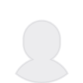

# Avatar
Themed avatar.

[Example](#example)

This is the themed version of
[Avatar from `topcoder-react-utils`](https://github.com/topcoder-platform/topcoder-react-utils/blob/HEAD/docs/avatar.md).
By default, it is rendered as a round-shaped image of 32px&nbsp;&times;&nbsp;32p
size with this default userpic:
.
You can further customize the styling via
[`react-css-super-themr`](https://www.npmjs.com/package/react-css-super-themr) mechanics.

### Example
```scss
// style.scss

/* Just to demonstrate ad-hoc styling in action. */
.largeAvatar {
  border-radius: 128px;
  height: 256px;
  width: 256px;
}
```
```jsx
import React from 'react';
import { Avatar } from 'topcoder-react-ui-kit';

import style from './style.scss';

export default function Example() {
  return (
    <div>
      {/* Avatar with the default userpic and style. */}
      <Avatar />

      {/* Large avatar with the specified userpic. */}
      <Avatar
        theme={{ avatar: style.largeAvatar }}
        url="URL/OF/THE/USERPIC/TO/USE"
      />
    </div>
  );
}
```