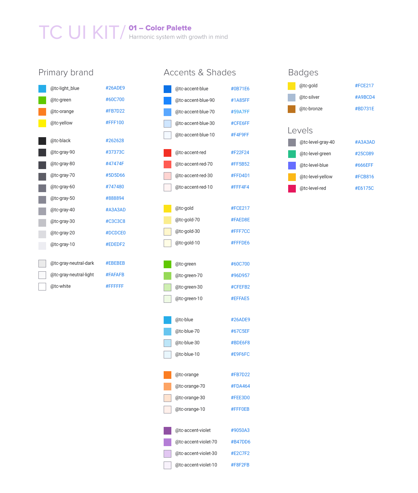

# Variables
SCSS mixins for standard colors, design breaking points and other global style
constants.

### Base Spacings
*Note:* The constants from this section are defined mostly for documentation
purposes. Although SCSS allows to really encode layout spacings as mathematical
expressions using these constants; it is not practical, as results in less
readable SCSS code and demands one to calculate the resulting values in head to
check whether the numbers match the design specifications (which usually give
the final numbers). Thus, for border radii and spacings prefer to put the final
numbers directly into your SCSS code.
- **`$base-unit`** &mdash; *5px* &mdash; All layout spacings in Topcoder designs
  are multiples of this value.
- **`$corner-radius`** &mdash; *2px* &mdash; All corner radii (`border-radius`
  CSS prop) in Topcoder designs are multiples of this value.

### Design Break Points
Each of the following constants specifies the maximal size of the corresponding
screen size; i.e. XS-screen (extra-small) is any screen with the width smaller
or equal to `$tc-screen-xs`, SM-screen (small) is any screen with the width
larger than `$tc-screen-xs` and smaller or equal to `$tc-screen-sm`, and so on.
The screen size wider than `$tc-screen-lg` we call XL for extra-large.

We assume that mobile devices have SM screen size, tablets have MD screen size,
and desktops have LG or XL screen size. Whenever you need to restric the maximal
width of the main page part, rely on `$tc-screen-lg` as the maximal width.

- **`$tc-screen-xs`** &mdash; *320px*;
- **`$tc-screen-sm`** &mdash; *768px*;
- **`$tc-screen-md`** &mdash; *1024px*;
- **`$tc-screen-lg`** &mdash; *1280px*.

### Colors
Here are the standard colors to be used in Topcoder designs. They match the
design specs image below, but some of them have different names due to historic
reasons:

##### Primary Colors
- **`$tc-light-blue`** &mdash; `#26ade9`;
- **`$tc-green`** &mdash; `#60c700`;
- **`$tc-orange`** &mdash; `#fb7d22`;
- **`$tc-yellow`** &mdash; `#fff100`;

- **`$tc-black`** &mdash; `#262628`;
- **`$tc-gray-90`** &mdash; `#37373c`;
- **`$tc-gray-80`** &mdash; `#47474f`;
- **`$tc-gray-70`** &mdash; `#5d5d66`;
- **`$tc-gray-60`** &mdash; `#747480`;
- **`$tc-gray-50`** &mdash; `#888894`;
- **`$tc-gray-40`** &mdash; `#a3a3ad`;
- **`$tc-gray-30`** &mdash; `#c3c3c8`;
- **`$tc-gray-20`** &mdash; `#dcdce0`;
- **`$tc-gray-10`** &mdash; `#ededf2`;

- **`$tc-gray-neutral-dark`** &mdash; `#ebebeb`;
- **`$tc-gray-neutral-light`** &mdash; `#fafafb`;
- **`$tc-white`** &mdash; `#fff`;

##### Accents & Shades
- **`$tc-dark-blue`** &mdash; `#0a71e6`;
- **`$tc-dark-blue-90`** &mdash; `#1a85ff`;
- **`$tc-dark-blue-70`** &mdash; `#59a7ff`;
- **`$tc-dark-blue-30`** &mdash; `#cfe6ff`;
- **`$tc-dark-blue-10`** &mdash; `#f4f9ff`;

- **`$tc-red`** &mdash; `#f22f24`;
- **`$tc-red-70`** &mdash; `#ff5b52`;
- **`$tc-red-30`** &mdash; `#ffd4d1`;
- **`$tc-red-10`** &mdash; `#fff4f4`;

- **`$tc-gold`** &mdash; `#fce217`;
- **`$tc-gold-70`** &mdash; `#faed8e`;
- **`$tc-gold-30`** &mdash; `#fff7cc`;
- **`$tc-gold-10`** &mdash; `#fffde6`;

- **`$tc-green`** &mdash; `#60c700`;
- **`$tc-green-70`** &mdash; `#96d957`;
- **`$tc-green-30`** &mdash; `#cfefb2`;
- **`$tc-green-10`** &mdash; `#effae5`;

- **`$tc-light-blue`** &mdash; `#26ade9`;
- **`$tc-light-blue-70`** &mdash; `#67c5ef`;
- **`$tc-light-blue-30`** &mdash; `#bde6f8`;
- **`$tc-light-blue-10`** &mdash; `#e9f6fc`;

- **`$tc-orange`** &mdash; `#fb7d22`;
- **`$tc-orange-70`** &mdash; `#fda464`;
- **`$tc-orange-30`** &mdash; `#fee3d0`;
- **`$tc-orange-10`** &mdash; `#fff0eb`;

- **`$tc-purple`** &mdash; `#9050a3`;
- **`$tc-purple-70`** &mdash; `#b47dd6`;
- **`$tc-purple-30`** &mdash; `#e2c7f2`;
- **`$tc-purple-10`** &mdash; `#f8f2fb`;

##### Badges
- **`$tc-gold`** &mdash; `#fce217`;
- **`$tc-silver`** &mdash; `#a9bcd4`;
- **`$tc-bronze`** &mdash; `#bd731e`;

##### Levels
- **`$tc-level-1`** &mdash; `$a3a3ad`;
- **`$tc-level-2`** &mdash; `#25c089`;
- **`$tc-level-3`** &mdash; `#666eff`;
- **`$tc-level-4`** &mdash; `#fcb816`;
- **`$tc-level-5`** &mdash; `#e6175c`;

